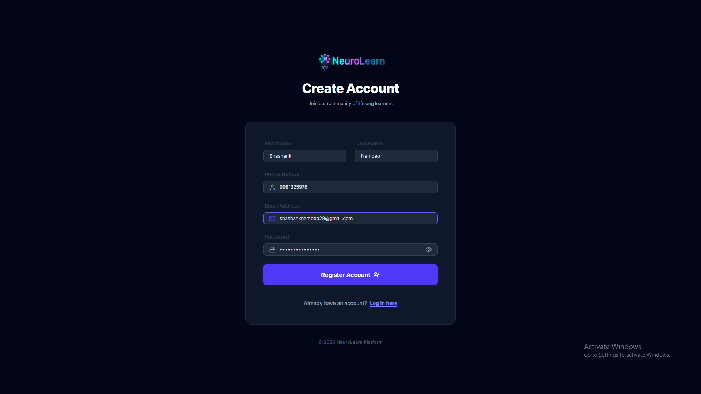
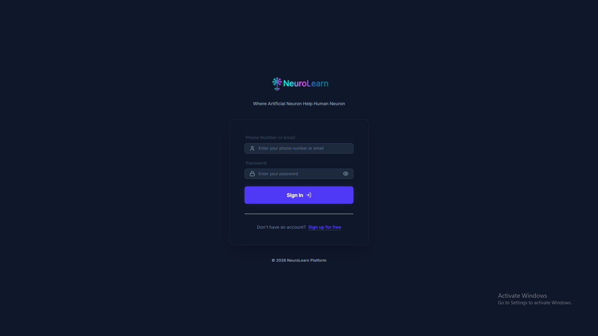
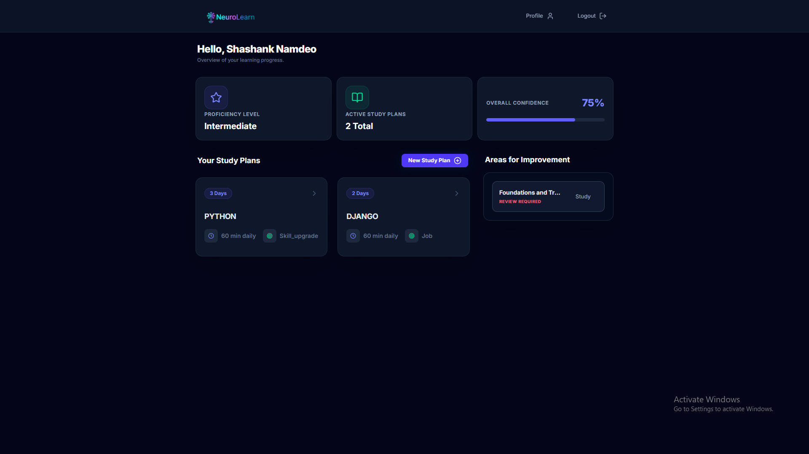
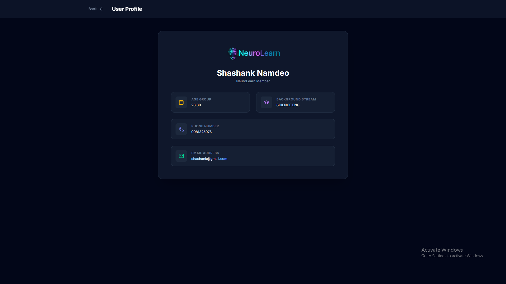
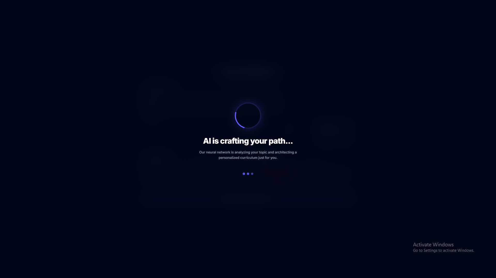
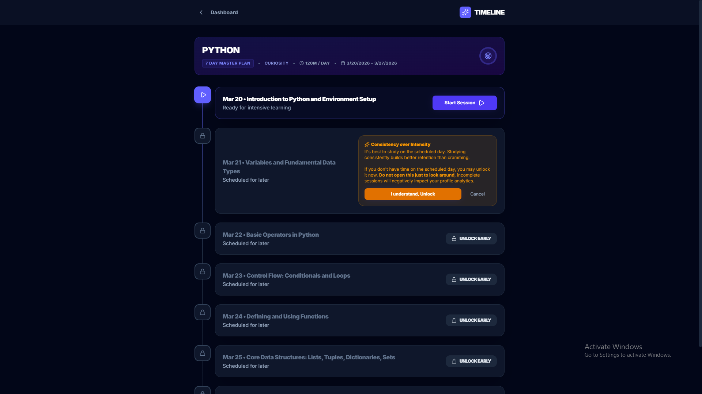
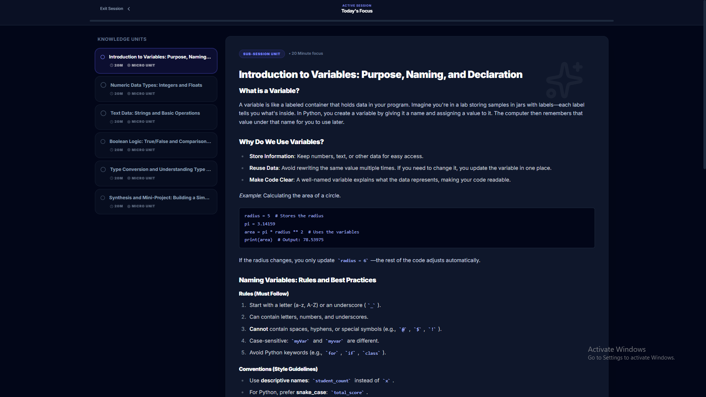
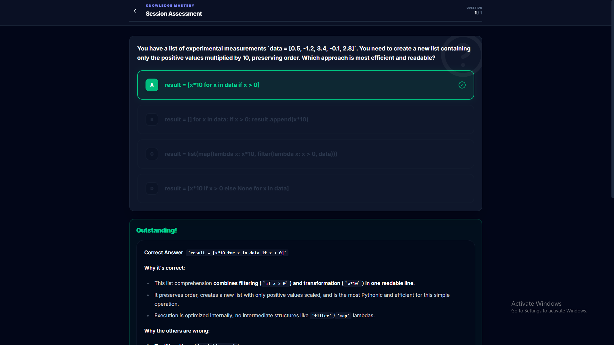
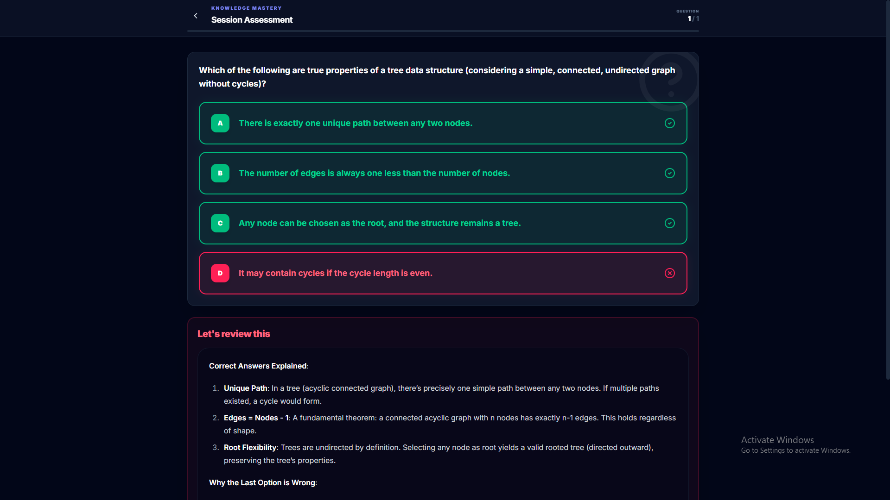

# NeuroLearn 🧠

**NeuroLearn** is an AI-powered personalized learning platform designed to help students master complex concepts at their own pace. By leveraging advanced AI, it creates tailored study paths and adaptively explains topics based on student performance.

---

> [!CAUTION]
> **Proprietary Software**: All rights reserved. This code is for showcase purposes only. See the [NOTICE](NOTICE) file for details.

---

## 🚀 Key Features

- **AI Study Plan Generator**: Generates custom, day-by-day learning paths based on your specific goals.
- **Adaptive Learning Session**: Concept explanations that dynamically adjust to your level of understanding.
- **AI-Powered Quizzes**: Real-time evaluation that identifies and focuses on your weak areas.
- **Adaptive Explanation Engine**: Simplifies concepts on-the-fly if you struggle with the current explanation.
- **Progress Tracking**: Detailed metrics for confidence, mastery, and topic-specific performance.


## 📸 Screenshots

<p align="center">
  <a href="./screenshots/Register.png">
    
  </a>
  <a href="./screenshots/Login.png">
    
  </a>
</p>

<p align="center">
  <a href="./screenshots/Dashboard-1.png">
    
  </a>
  <a href="./screenshots/UserProfile.png">
    
  </a>
</p>

<p align="center">
  <a href="./screenshots/StudyplanCreation-1.png">
    
  </a>
  <a href="./screenshots/AIGeneration.png">
    
  </a>
</p>

<p align="center">
  <a href="./screenshots/Timeline-1.png">
    
  </a>
  <a href="./screenshots/Lesson-1.png">
    
  </a>
</p>

<p align="center">
  <a href="./screenshots/QuizSingleCorrect.png">
    
  </a>
  <a href="./screenshots/QuizMultiCorrect.png">
    
  </a>
</p>


## 🛠️ Tech Stack

- **Backend**: Python, Django, Django REST Framework, PostgreSQL, OpenRouter AI.
- **Frontend**: React, Vite, TailwindCSS v4, Lucide React, Framer Motion.
- **AI**: Integrated with OpenRouter for state-of-the-art LLM capabilities.

## ⚙️ Getting Started

### Prerequisites
- Python 3.10+
- Node.js 18+
- PostgreSQL installed and running

### Backend Setup

1. **Navigate** to the `backend` directory.
2. **Install dependencies**: 
   ```bash
   pip install -r requirements.txt
   ```
3. **Environment Configuration**:
   - Rename `.env.example` (or use the existing `.env`) and fill in:
     - `OPENROUTER_API_KEY`
     - `DJANGO_SECRET_KEY`
     - PostgreSQL credentials (`DB_NAME`, `DB_USER`, `DB_PASSWORD`, etc.)
4. **Run Migrations**:
   ```bash
   python manage.py migrate
   ```
5. **Start Server**:
   ```bash
   python manage.py runserver
   ```

### Frontend Setup

1. **Navigate** to the `frontend` directory.
2. **Install dependencies**:
   ```bash
   npm install
   ```
3. **Start Development Server**:
   ```bash
   npm run dev
   ```

## 📈 Roadmap

- [ ] Mobile Application (React Native)
- [ ] Collaborative Study Groups
- [ ] Integration with Learning Management Systems (LMS)

---

Developed by [Shashank Namdeo](https://github.com/shashanknamdeo)
